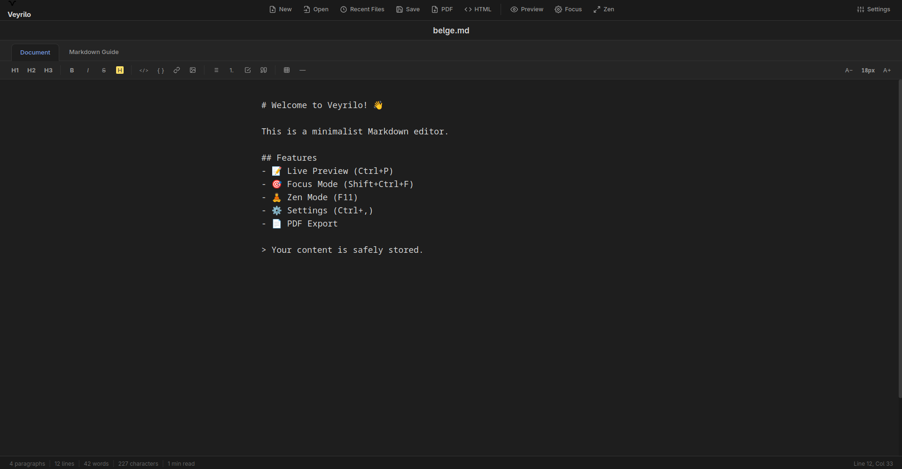
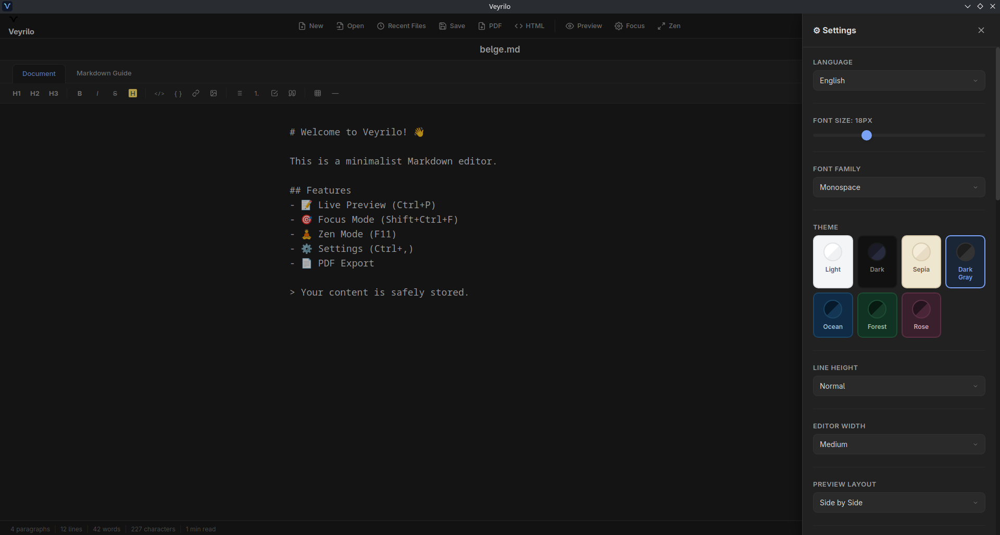
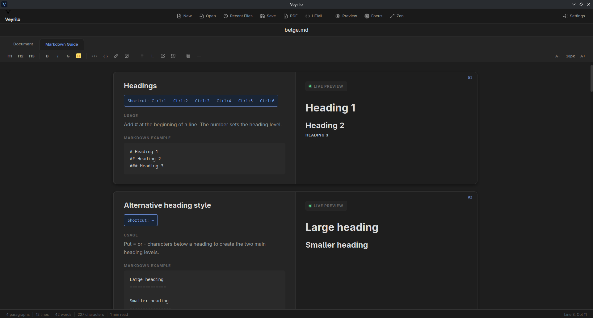

# Veyrilo

> Thoughts, in flow.

**English** · [Türkçe](README.tr.md)

[](https://github.com/Utkucan-W/veyrilo-markdown-editor/actions/workflows/ci.yml)
[](https://github.com/Utkucan-W/veyrilo-markdown-editor/releases/latest)
[](LICENSE)

Veyrilo is a calm, local-first Markdown editor for Linux. It pairs a focused
writing surface with a live preview, practical formatting tools, and native
desktop file handling — without an account, a subscription, or an online
service.

Veyrilo is free and always will be. It is not sold, it contains no ads, and it
sends nothing anywhere. If you find a bug or want a feature, please
[open an issue](https://github.com/Utkucan-W/veyrilo-markdown-editor/issues) — that is exactly
what this repository is here for.

Built with [Tauri 2](https://v2.tauri.app/), vanilla JavaScript, and Rust.

## Screenshots



| Settings and themes | Built-in Markdown Guide |
| --- | --- |
|  |  |

## Features

### Writing

- Live preview of GitHub Flavored Markdown, side by side with the editor.
- The preview follows the editor's scroll position by matching real blocks, not
  just a percentage of the page.
- Lists continue automatically: press Enter on a bullet, a numbered item, or a
  task item and the next one is created for you. Press Enter on an empty item to
  end the list.
- `Tab` and `Shift+Tab` indent and outdent every selected line at once.
- Paste a web address over selected text and it becomes a Markdown link.
- Fenced code blocks get their own background in the editor, so code is easy to
  find while writing.
- Live statistics: word count, character count, and cursor position.

### Formatting

- A toolbar for headings, bold, italic, strikethrough, highlight, inline code,
  code blocks, links, images, quotes, lists, task lists, tables, and horizontal
  rules.
- **33 keyboard shortcuts, all reassignable** from Settings → Keyboard Shortcuts.
  Conflicts are detected as you record a new combination, and toolbar tooltips
  update immediately.
- A table builder dialog: pick rows and columns and get a ready Markdown table.

### Finding and replacing

- `Ctrl+F` searches the document, shows the match count, highlights every match
  in place, and scrolls the active one into view. Enter and `Shift+Enter` move
  between results.
- `Ctrl+H` opens find and replace. Replace the selected match, or replace all of
  them — replacing all counts as a **single undo step**.

### Reading and focus

- **Focus mode** dims every paragraph except the one you are writing in.
- **Zen mode** (`F11`) hides the interface completely.
- **Seven themes**: Light, Dark, Sepia, Dark Gray, Ocean, Forest, and Rose, each
  with its own text, accent, selection, and panel colors.
- Adjustable font size, with `Ctrl+=` and `Ctrl+-`.

### Built-in Markdown Guide

A separate tab with **18 topics** in Turkish and English. Each card shows the
shortcut, the explanation, the Markdown source, and a real rendered preview of
that exact example, side by side. The shortcuts shown in the guide are read from
your live settings, so they stay correct after you reassign a key.

### Files

- Open and save local Markdown and text files through native desktop dialogs.
- **Drag and drop** a Markdown or text file onto the window to open it.
- Open a file with right-click → *Open with* from your Linux file manager.
- A recent files menu for quickly reopening earlier documents.
- Closing the window with unsaved changes asks for confirmation first.
- Export to **HTML**, or produce a **PDF** through the system print dialog.

### Interface

- Full Turkish and English interface, switchable at runtime.
- Works completely offline: the Markdown, sanitization, and syntax highlighting
  libraries are bundled inside the application.

## Install on Linux

The automated release workflow produces an x86_64 Debian package (`.deb`).
Fedora RPM and Arch packages are not published yet; use the source-install path
for those distributions.

### Debian and Ubuntu

Download the `Veyrilo_*_amd64.deb` asset from the
[latest release](https://github.com/Utkucan-W/veyrilo-markdown-editor/releases/latest), then run
this in the directory containing the download:

```bash
sudo apt install ./Veyrilo_*_amd64.deb
```

This installs Veyrilo into the application menu and resolves its normal GTK and
WebKit runtime dependencies through APT. Node.js, Rust, and other development
tools are not required.

### Fedora

An RPM release asset is not available yet. To install Veyrilo on Fedora today,
clone the project and build it locally:

```bash
git clone https://github.com/Utkucan-W/veyrilo-markdown-editor.git
cd veyrilo-markdown-editor
sudo dnf install nodejs npm rust cargo gcc-c++ webkit2gtk4.1-devel gtk3-devel libappindicator-gtk3-devel librsvg2-devel
npm install
npm run install:local
```

The final command builds Veyrilo and adds it to the current user's application
menu. Do not install the Debian release asset with `rpm` or `dnf`.

### Arch Linux and CachyOS

An Arch package (`.pkg.tar.zst`) is not available yet. Build and install from
the repository instead:

```bash
git clone https://github.com/Utkucan-W/veyrilo-markdown-editor.git
cd veyrilo-markdown-editor
sudo pacman -S --needed nodejs npm rust base-devel webkit2gtk-4.1 gtk3 libappindicator-gtk3 librsvg
npm install
npm run install:local
```

For development without a menu installation, replace the last command with
`npm run desktop:dev`. Do not use the Debian `.deb` asset with `pacman`.

### Removing a local installation

```bash
npm run uninstall:local
```

## Keyboard shortcuts

Every shortcut below is a default and can be changed in
Settings → Keyboard Shortcuts.

| Action | Shortcut |
| --- | --- |
| Bold / Italic / Strikethrough | `Ctrl+B` · `Ctrl+I` · `Ctrl+D` |
| Highlight / Inline code | `Ctrl+Shift+M` · `Ctrl+E` |
| Code block | `Ctrl+Shift+E` |
| Heading 1–6 | `Ctrl+1` … `Ctrl+6` |
| Link / Image | `Ctrl+K` · `Ctrl+Shift+G` |
| Bulleted / Numbered / Task list | `Ctrl+Shift+L` · `Ctrl+Shift+O` · `Ctrl+Shift+X` |
| Quote / Table / Horizontal rule | `Ctrl+Shift+Q` · `Ctrl+Shift+T` · `Ctrl+Shift+-` |
| Undo / Redo | `Ctrl+Z` · `Ctrl+Y` |
| Find / Find and replace | `Ctrl+F` · `Ctrl+H` |
| Toggle preview | `Ctrl+P` |
| Focus mode / Zen mode | `Ctrl+Shift+F` · `F11` |
| New / Open / Save | `Ctrl+N` · `Ctrl+O` · `Ctrl+S` |
| Settings | `Ctrl+,` |
| Font size | `Ctrl+=` · `Ctrl+-` |
| Indent / Outdent selected lines | `Tab` · `Shift+Tab` |

## Reporting bugs and requesting features

Bug reports and ideas are genuinely welcome — they are the main reason this
project is public.

- **Something is broken?** Open a
  [bug report](https://github.com/Utkucan-W/veyrilo-markdown-editor/issues/new?template=bug_report.yml).
  Please include your distribution, how you installed Veyrilo, and the steps
  that reproduce the problem.
- **Want a feature?** Open a
  [feature request](https://github.com/Utkucan-W/veyrilo-markdown-editor/issues/new?template=feature_request.yml)
  and describe what you are trying to do.
- **Found a security issue?** Please do not open a public issue; see
  [SECURITY.md](SECURITY.md) for private reporting.

Pull requests are welcome too. Read [CONTRIBUTING.md](CONTRIBUTING.md) first,
and note that this project follows a [Code of Conduct](CODE_OF_CONDUCT.md).

## Build from source

### Requirements

Building from source requires Node.js 20 or later, npm, and Rust. On Linux,
install the platform packages listed for your distribution above first.

### Get started

```bash
git clone https://github.com/Utkucan-W/veyrilo-markdown-editor.git
cd veyrilo-markdown-editor
npm install
npm start
```

The clone-and-run flow is for contributors. Regular users should use the
prebuilt package from GitHub Releases above.

### Development commands

```bash
# Validate JavaScript syntax
npm run check

# Run the test suite
npm test

# Build a Linux x64 desktop application (.deb)
npm run dist

# Build and add to the current user's application menu
npm run install:local
```

The generated Debian package is written to
`src-tauri/target/release/bundle/deb/`. Install it with your distribution's
package manager:

```bash
sudo apt install ./src-tauri/target/release/bundle/deb/Veyrilo_*.deb
```

The generated menu launcher starts Veyrilo through XWayland, configures Tauri's
window backend for X11, and disables WebKit's DMA-BUF renderer for reliable
startup on Wayland systems with affected GPU drivers.

## Project structure

```text
.
├── src-tauri/       # Rust commands, Tauri window, and Linux bundling setup
├── index.html       # Application shell
├── css/             # Interface styles
├── js/              # Editor, guide, search, preview, export, and UI modules
├── test/            # Security and utility regression tests
└── package.json     # Scripts and dependencies
```

## PDF export

PDF export opens the operating system print dialog. Choose “Print to PDF” or the
equivalent option in the dialog; this avoids requiring WeasyPrint or another
external converter. The printed output uses a fixed light palette, so a document
written in a dark theme stays readable on paper.

## Privacy and security

Veyrilo stores the current session draft, preferences, filename, and keyboard
shortcuts in the application's local storage on your own machine. It has no
accounts, no telemetry, and no network calls. It does not require an online
service for editing or rendering Markdown.

Markdown is sanitized with DOMPurify before preview or export, and external
links are limited to `http` and `https` URLs.

To report a vulnerability privately, see [SECURITY.md](SECURITY.md).

## Maintainer release process

Maintainers can publish a version by pushing a version tag. GitHub Actions runs
the checks, builds the Linux `.deb`, and attaches it to a GitHub Release:

```bash
git tag v1.0.1
git push origin v1.0.1
```

The workflow files are in `.github/workflows/ci.yml` and
`.github/workflows/release.yml`.

## License

Veyrilo is available under the [MIT License](LICENSE) — free to use, modify, and
redistribute.

The compiled application bundles third-party components under their own
permissive licenses; see [THIRD-PARTY-LICENSES.md](THIRD-PARTY-LICENSES.md).

### Trademarks

The "Veyrilo" name and the Veyrilo logo (the files under `branding/`) are **not**
covered by the MIT License. The MIT terms let you build, modify, and redistribute
the software, but they do not grant permission to use the Veyrilo name or logo in
a way that implies endorsement by, or affiliation with, this project. A
redistributed fork that could be confused with the original must use a different
name and icon.
